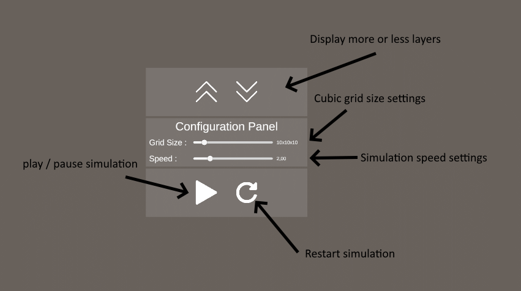
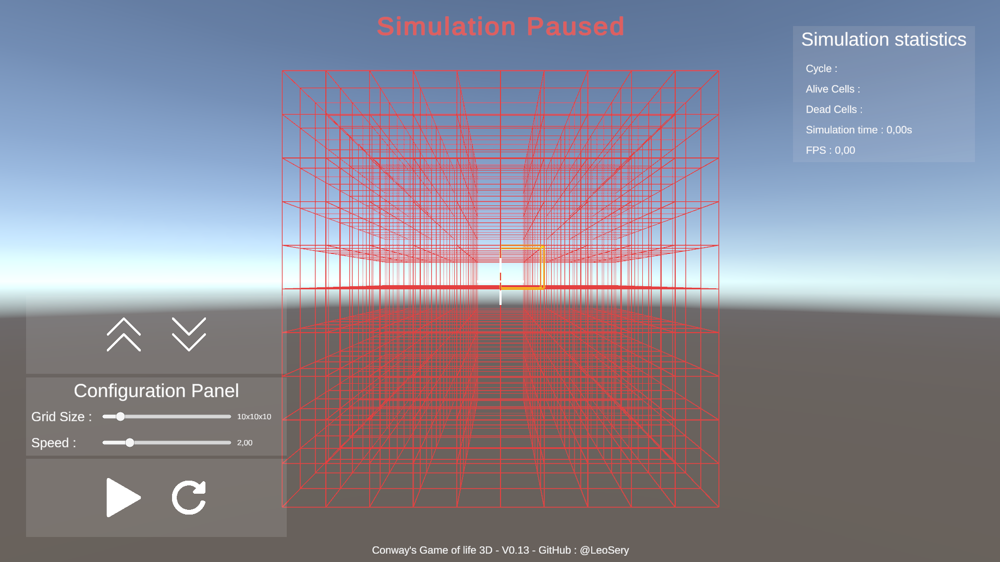
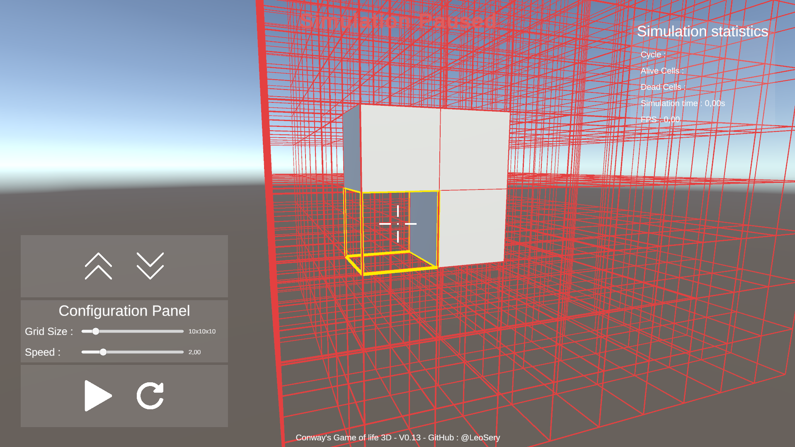
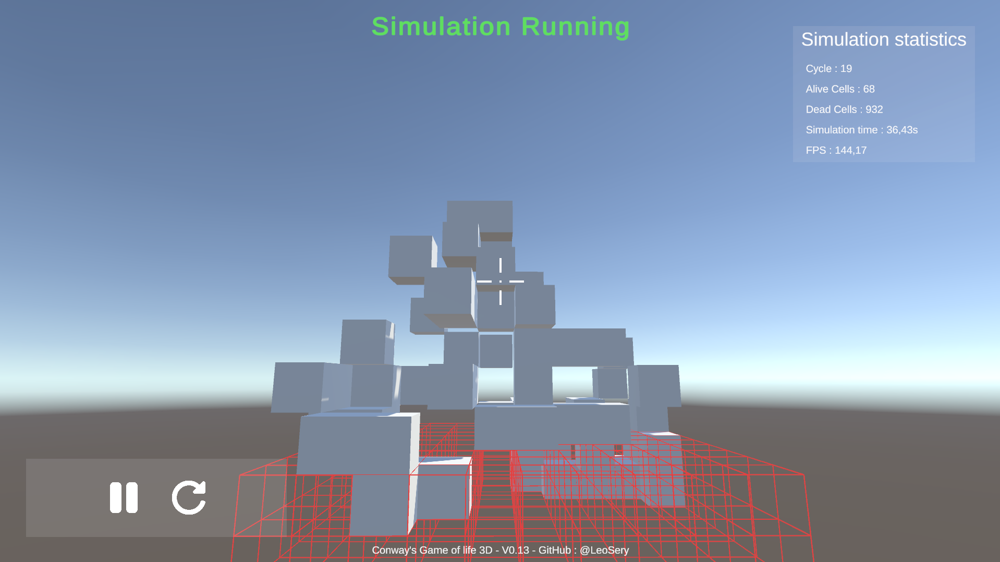
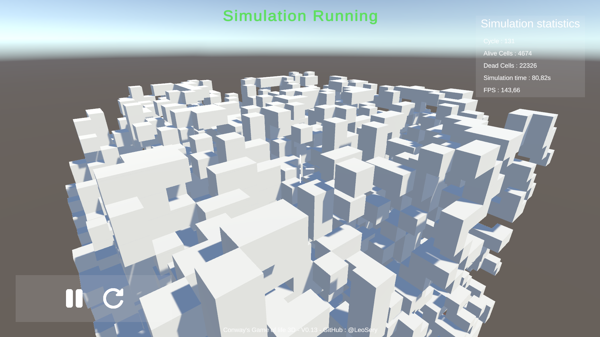

# Game-of-Life-3D--Unity3D-2024

This project is a 3D implementation of Conway's Game of Life, realized in C# with Unity. It's a cellular automaton simulation where cells evolve in a cubic space according to simple rules, generating patterns over the course of iterations. The user can interact with the grid in real time, adding or deleting cells, adjusting simulation speed and exploring 3D space with a free-form camera. The project focuses on performance and optimization.


## Summary

- [Project pitch](#project-pitch)
- [Project pictures](#project-pictures)
- [Technical part](#technical-part)
- [How to play the demo](#how-to-play-the-demo)

## Project pitch

This project implements a 3D version of Conway's Game of Life using Unity and C#.

More information about “*Conway's Game of Life*” [Here](https://en.wikipedia.org/wiki/Conway%27s_Game_of_Life) : 

Features included :

- Interactive 3D grid with adjustable size (5x5x5 to 50x50x50)
- User interface to control simulation (pause, speed, reset)
- Free camera to explore the grid
- Real-time interaction (adding/deleting cells) via a highlight system
- Optimizations to manage large grids
- Statistics display (cycles, live/dead cells, FPS)

The project focuses on performance, optimization and scalability.

- Controls :

    Moving :
    - Moving forward > `Z`
    - Moving Left > `Q`
    - Moving backwards > `S`
    - Moving Right > `D`

    Camera :
    - Orient camera > `Mouse`

    Cells :
    - Place > `Right click`
    - Destroy > `Left click`

    Grid (using the in-game UI or) :
    - Show more layers > `Left Shift`
    - Show one layer less > `Left CTRL`

    Simulation control (Using the in-game UI) : 
    
    

## Project pictures











## Technical Part 

In this section, we'll delve into some of the key technical aspects of our 3D Game of Life implementation. We'll focus on three crucial elements that showcase our approach to performance optimization and 3D space management.

### 1. Efficient Cell State Management

We use a static class to define cell states, which allows for clear and efficient state management :

```csharp
public static class CellState
{
    public const byte Dead = 0;
    public const byte Alive = 1;
    public const byte ActiveZone = 2;
}
```

This approach offers several advantages:

- It provides a clear, centralized definition of `cell states`.
- Using `byte` type and constants ensures minimal memory usage and fast comparisons.
- The `ActiveZone` state helps optimize grid updates by focusing only on areas where changes can occur.

### 2. Optimized 3D Grid Structure

The core of our 3D grid is implemented with careful consideration for performance :

```csharp
private readonly HashSet<int3> activeCells;
private readonly Dictionary<int3, byte> cellStates;

private static readonly int3[] neighborOffsets =
{
    new(-1, -1, -1), new(-1, -1, 0), new(-1, -1, 1),
    new(-1, 0, -1),  new(-1, 0, 0),  new(-1, 0, 1),
    new(-1, 1, -1),  new(-1, 1, 0),  new(-1, 1, 1),
    new(0, -1, -1),  new(0, -1, 0),  new(0, -1, 1),
    new(0, 0, -1),                   new(0, 0, 1),
    new(0, 1, -1),   new(0, 1, 0),   new(0, 1, 1),
    new(1, -1, -1),  new(1, -1, 0),  new(1, -1, 1),
    new(1, 0, -1),   new(1, 0, 0),   new(1, 0, 1),
    new(1, 1, -1),   new(1, 1, 0),   new(1, 1, 1)
};
```

Key points about this implementation :

- `HashSet<int3>` for `activeCells` allows for fast lookups and ensures unique entries.
- `Dictionary<int3, byte>` for `cellState` provides quick state access for each cell.
- The `neighborOffsets` array pre-computes all possible neighbor positions, optimizing neighbor checks in 3D space.
- Using `int3` (from *Unity.Mathematics*) for positions enables efficient 3D coordinate handling.

### 3. Efficient Neighbor Checking

The `neighborOffsets` array is crucial for efficient neighbor checking in 3D space :

```csharp
public int CountAliveNeighbors(int3 position)
{
    return neighborOffsets.Count(offset =>
    {
        int3 neighborPos = position + offset;
        return cellStates.TryGetValue(neighborPos, out byte state) && state == CellState.Alive;
    });
}
```

This method efficiently counts alive neighbors by :

- Using the pre-computed `neighborOffsets` to check all 26 neighbors in 3D space.
- Leveraging *LINQ* for a concise yet performant count operation.
- Utilizing `Dictionary.TryGetValue` for optimized state lookups.

These optimizations allow our 3D Game of Life to handle large grids efficiently, providing a smooth and responsive user experience even with complex 3D patterns.

## How to download the game

The game is available on windows `(x64)` [here](https://github.com/LeoSery/Conway-s-Game-of-Life-3D--Unity3D-2024/releases) 